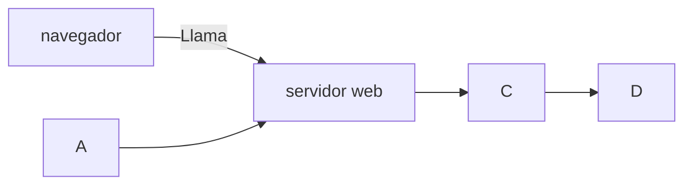

+++
title = 'Programacion'
date = 2024-10-04T13:57:48+02:00
draft = false
weight = 10
+++

## Programacion

Codigo de php
```php
<?php
$a = rand(1,210);
?>
```




PHP es un lenguaje interesante y bonito Accede a la web

